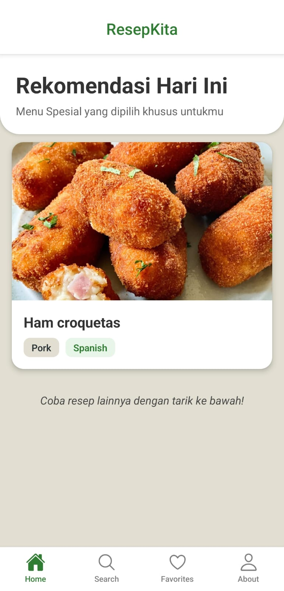
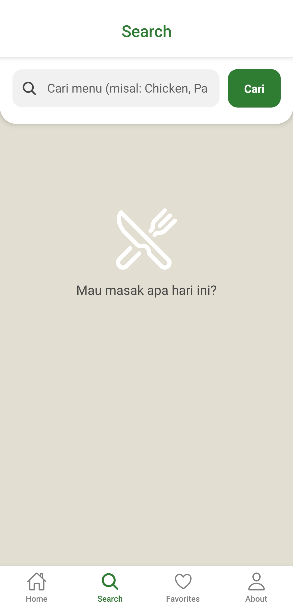
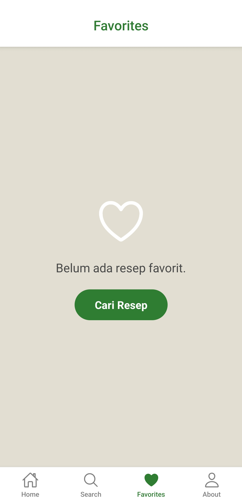
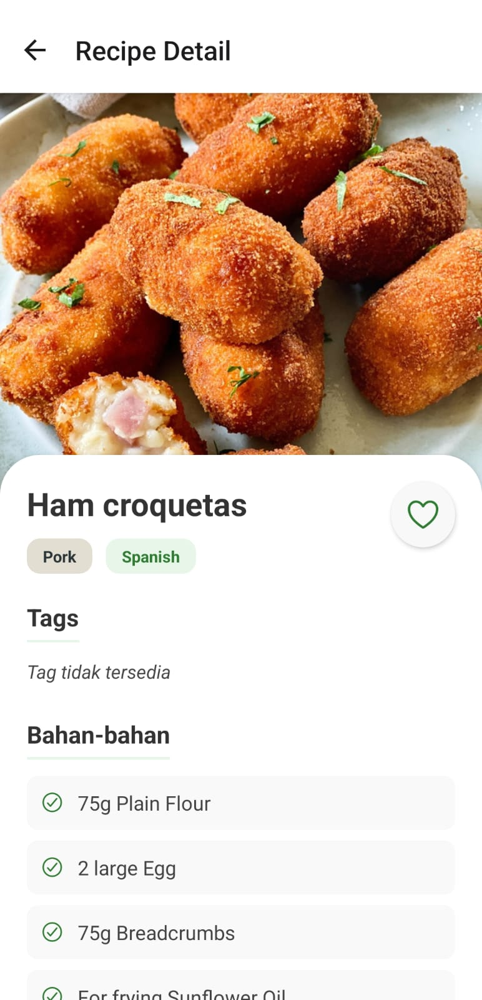
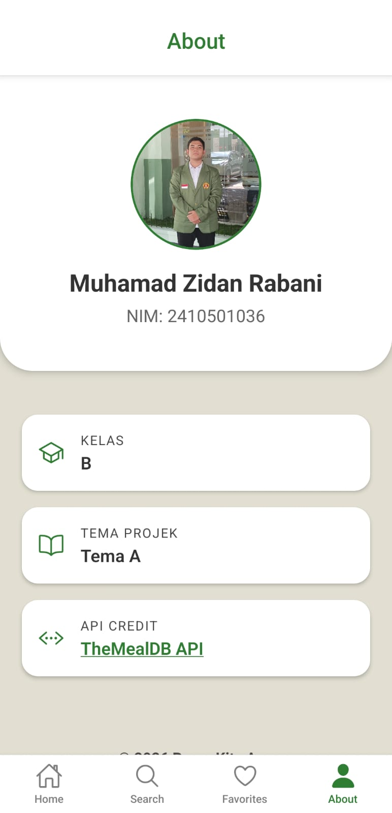

# ResepKita - Recipe Application

UTS Pemrograman Mobile Lanjut.

## Identitas Kelompok
- **Nama**: Muhamad Zidan Rabani
- **NIM**: 2410501036
- **Kelas**: B
- **Tema Projek**: Tema A - ResepKita

---

## Tech Stack & Versi
- **Framework**: React Native (v0.81.5) dengan Expo SDK (v54.0.33)
- **State Management**: Zustand (v5.0.12)
- **Navigation**: React Navigation Native (v7.2.2), Bottom Tabs (v7.15.9), Stack (v7.8.10)
- **Local Storage**: AsyncStorage (v2.2.0)
- **API**: Fetch API native (Endpoint: TheMealDB API)

---

## Cara Install & Menjalankan Aplikasi

Pastikan Anda sudah menginstall **Node.js** dan memiliki akun **Expo Go** di HP Anda.

1. Clone repositori ini:
   ```bash
   git clone https://github.com/Zephyr-017/ResipeApp.git
   ```
2. Pindah ke direktori proyek:
   ```bash
   cd RecipeApp
   ```
3. Install dependensi:
   ```bash
   npm install
   ```
4. Jalankan aplikasi:
   ```bash
   npx expo start
   ```
5. Buka aplikasi **Expo Go** di HP (Android/iOS) dan scan QR Code yang muncul di terminal.

---

## Screenshots (5 Screen)
Berikut adalah tampilan antarmuka dari aplikasi ResepKita:

<p align="center">
  
  
  
</p>
<p align="center">
  
  
</p>

---

## Link Video Demo
Tonton video demo penggunaan aplikasi ResepKita di bawah ini:
👉 **[Tautan Video Demo YouTube / GDrive]** *(Nanti diisi)*

---

## Justifikasi Pemilihan State Management (Zustand)
Saya memilih Zustand sebagai pengelola state dalam proyek ini karena caranya yang sangat simpel dan ringan, sehingga kita tidak perlu menulis banyak kode rumit seperti pada Redux. Penggunaannya terasa sangat alami bagi pengembang React karena berbasis hooks, namun tetap memberikan performa yang cepat karena hanya memperbarui komponen yang memang membutuhkan data tersebut. Selain itu, Zustand sudah dilengkapi fitur canggih untuk menyimpan data secara otomatis ke memori perangkat (AsyncStorage), yang sangat memudahkan kita dalam mengelola fitur seperti daftar favorit tanpa konfigurasi yang membingungkan.

---

## Daftar Referensi
1. [React Native Official Documentation](https://reactnative.dev/docs/getting-started)
2. [Expo SDK Documentation](https://docs.expo.dev/)
3. [React Navigation 7.x](https://reactnavigation.org/)
4. [Zustand State Management](https://github.com/pmndrs/zustand)
5. [AsyncStorage Documentation](https://react-native-async-storage.github.io/async-storage/docs/usage/)
6. [Expo Vector Icons (Ionicons)](https://icons.expo.fyi/Index)
7. [TheMealDB Free API](https://www.themealdb.com/api.php)
8. [YouTube Tutorial - React Native Development](https://youtu.be/iPVaAy2LzPY?si=ZddgKavCXesrwBGg)
9. [React Navigation - Bottom Tab Navigator](https://reactnavigation.org/docs/bottom-tab-navigator/)
10. [React Navigation - Stack Navigator](https://reactnavigation.org/docs/stack-navigator/)
11. [YouTube Tutorial - App Architecture](https://youtu.be/cdnneQjsoT0?si=lpCC9u6fS9J6_M6p)
12. [React Custom Hooks Concept](https://react.dev/learn/reusing-logic-with-custom-hooks)

---

## 💡 Refleksi Pembuatan Aplikasi (Draft)

Dalam mengembangkan aplikasi ResepKita ini, banyak pelajaran berharga yang saya dapatkan, terutama terkait dengan struktur arsitektur React Native yang lebih modern. Tantangan utama di awal adalah bagaimana merancang navigasi yang mengkombinasikan *Bottom Tabs* untuk layar utama dan *Stack Navigator* untuk layar detail agar terasa natural bagi pengguna (UX). Selain itu, saya juga belajar banyak tentang pengelolaan *state* global menggunakan Zustand dan menyimpannya ke memori lokal via `AsyncStorage`. Ini membuktikan bahwa tidak selamanya kita harus menggunakan Redux yang *boilerplate*-nya tebal; alat seperti Zustand bisa menyelesaikan masalah yang sama dengan jauh lebih praktis dan cepat.

Aspek yang paling saya sukai selama pengerjaan adalah penerapan *Separation of Concerns* melalui pembuatan *Custom Hooks* (`useSearch`, `useMealDetail`, dll). Memisahkan logika bisnis (seperti mengambil data (API), validasi form, dan handling error) ke luar dari komponen antarmuka (UI) membuat kode menjadi lebih rapi, *readable*, dan mudah untuk dilakukan *maintenance* kedepannya. Jika diberi waktu tambahan, saya ingin mengimplementasikan fitur *skeleton loading* agar lebih interaktif, serta menyimpan data resep detail secara *offline caching* agar tidak terus memanggil API setiap kali berpindah halaman. Secara keseluruhan, proyek ini sangat mematangkan pemahaman saya tentang ekosistem pengembangan *mobile apps* menggunakan React Native dan Expo.
